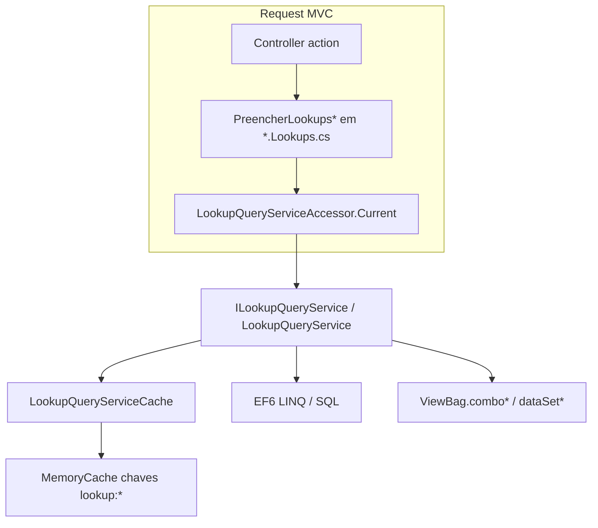
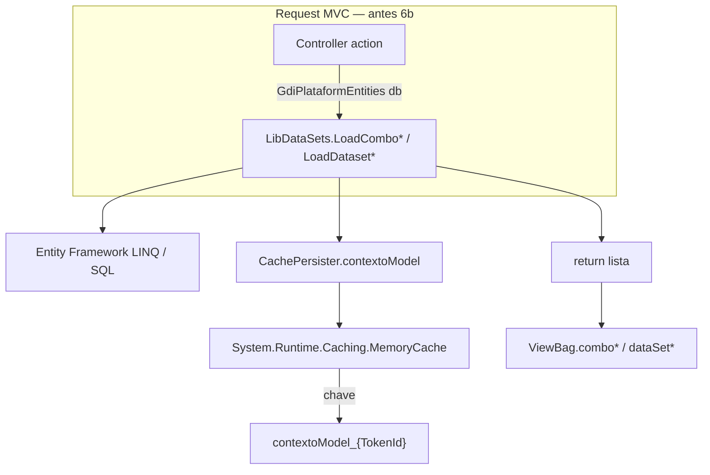

# LibDataSets — Diagnóstico completo e plano de modernização

**Projeto:** GDI-ERP-Plataform  
**Stack:** ASP.NET MVC 5, .NET Framework 4.7.2, Entity Framework 6, SQL Server  
**Data:** 2026-05-20  
**Ficheiro-fonte (histórico):** `Lib/LibDataSets.cs` — **removido na Onda 6b (2026-05-20)**. Contratos atuais: `Lib/Lookups/ILookupQueryService.cs`.

**Documentos relacionados:**

| Documento | Conteúdo |
|-----------|----------|
| Este ficheiro | Diagnóstico, arquitetura, riscos, plano de ação (Fases 0–5) |
| [2026_05_20_lookups-libdatasets.md](./2026_05_20_lookups-libdatasets.md) | Inventário método a método (Fase 0) + registo Fase 1 |
| `Scripts/2026_05_20_gdi_inventory_libdatasets.py` | Regenerar inventário a partir de `ILookupQueryService` |
| `Scripts/2026_05_20_gdi_inventory_libdatasets_usage.py` | Guardrail: zero refs `LibDataSets.*` (`--fail`) |
| `Scripts/2026_05_20_gdi_audit_lookup_get_names.py` | Auditar `Get*` em `*.Lookups.cs` vs contrato |

---

## 1. Resumo executivo

> **Estado atual (Onda 6b + 1.8, 2026-05-20):** `Lib/LibDataSets.cs` **foi removido**. Lookups vivem em **`ILookupQueryService`** + `LookupQueryService` (+ partials **Comercial**, **Financeiro**, **CadastrosG**) + **`LookupQueryServiceCache`**, consumidos por **`*.Lookups.cs`** (`LookupQueryServiceAccessor.Current`). O texto abaixo descreve o **legado** `LibDataSets` para contexto histórico e decisões de migração.

`LibDataSets` **era** uma **classe estática monolítica** (~1.806 linhas, removida) que centralizava a carga de **listas para `DropDownList`** (`List<SelectListItem>`) e **datasets auxiliares**. **Não** era `System.Data.DataSet` ADO.NET — o nome refletia o padrão legado “dados de apoio na sessão”.

| Indicador | Valor |
|-----------|-------|
| Métodos `Load*` | 67 (62 combos + 5 datasets) |
| Chamadas em controllers | ~227 em 19 ficheiros |
| Área **gc** | ~162 chamadas |
| Área **g** | ~45 chamadas |
| Área **qa** | ~4 chamadas |
| Maior consumidor | `MovimentosController` (~79 chamadas) |

**Conclusão:** é o principal mecanismo de lookups compartilhados em telas comerciais/COMEX/estoque; convive com lookups **locais** nos controllers (ex.: `ClientesController.PreencherLookupsClientesIndex`), padrão já adotado nas Index modernizadas.

**Status do plano (2026-05-20):**

| Fase | Estado |
|------|--------|
| **Fase 0** — Inventário | Concluída → [2026_05_20_lookups-libdatasets.md](./2026_05_20_lookups-libdatasets.md) |
| **Fase 1** — Cache paramétrico + null-safety parcial | ✅ Concluída (2026-05-20) — 9 métodos; código integrado depois no serviço |
| **Fase 2** — `ILookupQueryService` + implementação | ✅ Concluída (2026-05-20) — `Lib/Lookups/` |
| **Fase 3** — `LookupQueryServiceCache`; `ContextoModel` só UI (navbar) | ✅ Concluída (2026-05-20) |
| **Fase 4 P1–P4** — estrangulamento por módulo | ✅ Concluída (2026-05-20) — `*.Lookups.cs`; órfãos removidos |
| **Fase 5** — deprecação / partials finais | ✅ Concluída (2026-05-20) — preparação para remoção da fachada |
| **Onda 6a** — partials + `Wave6a`; remoção 34 `Load*` | ✅ Concluída (2026-05-20) |
| **Onda 6b** — remoção `LibDataSets.cs` + slots `ContextoModel` | ✅ Concluída (2026-05-20) |

---

## 2. Diagnóstico — arquitetura

### 2.1 Fluxo atual (pós-Onda 6b)



### 2.2 Fluxo legado (histórico — `LibDataSets.cs` removido)



### 2.3 Padrão interno legado (repetido em ~67 métodos `Load*`)

1. Recebe `GdiPlataformEntities db` (instância do controller).
2. Verifica cache em `CachePersister.contextoModel` (propriedades em `Models/ContextoModel.cs`, ~50+ listas).
3. Se lista vazia **ou** `LibDB.IsTableUpdate(tabela, nomeProcesso, db)` → consulta EF/SQL, monta `SelectListItem`, grava em `contextoModel`.
4. Retorno:
   - **~63 métodos:** cópia profunda via `JsonConvert.SerializeObject` + `DeserializeObject`;
   - **~5 datasets:** retorno direto da lista em cache (ex.: `LoadDatasetGVendedores`, `LoadDatasetGcProdutosServicos`).

### 2.4 Inicialização e ciclo de vida (legado)

| Momento | Comportamento |
|---------|----------------|
| **Login** | `UserIdentityController` cria `new ContextoModel { allNavbarItemMenu = ... }` e atribui `CachePersister.contextoModel`. |
| **MemoryCache** | Chave `contextoModel_{TokenId}`, sliding expiration **15 minutos** (`CachePersister.cs`). |
| **Construtor `ContextoModel`** | Inicializa dezenas de `List<SelectListItem>` e datasets vazios. |
| **Primeiro `Load*`** | Preenche a propriedade correspondente sob demanda (lazy por combo). |
| **Invalidação** | `LibDB.IsTableUpdate` compara `MAX(datahora_cadastro/alteracao)` da tabela com timestamp em `userIdentity.ListTablesUpdate` (par tabela + nome do processo). Em exceção, força refresh (`TableUpdate = true`). |

**Não há:** injeção de dependência, factory nem registro central de lookups — apenas chamadas estáticas nos controllers.

### 2.5 Propósito (legado)

| Função | Descrição |
|--------|-----------|
| **Combos reutilizáveis** | Evitar repetir LINQ em dezenas de actions (“lista de clientes”, “CFOP”, “locais de estoque”, etc.). |
| **Cache de sessão** | Reduzir round-trips SQL na navegação entre telas do mesmo usuário. |
| **Datasets para JS** | Ex.: `LoadDatasetGcProdutosServicos`, `LoadDatasetGcClientesContatos` → `ViewBag.dataSet*` para autocomplete/validação no cliente. |
| **Regras embutidas** | Filtros por role (`gc_Movimentos_*`), vendedor, flags (`param_gc_transportadora`), opções fixas hardcoded (ex. tipos de movimento compras). |

### 2.6 Onde era utilizada (pré-6b; hoje `*.Lookups.cs`)

**Controllers consumidores (19 ficheiros):**

- `Areas/gc/Controllers/MovimentosController.cs` (~79)
- `Areas/gc/Controllers/MovimentosComprasController.cs` (~28)
- `Areas/gc/Controllers/FinanceiroLancamentosController.cs` (~16)
- `Areas/g/Controllers/AtendimentosController.cs` (~16)
- `Areas/gc/Controllers/EstoqueInventarioController.cs` (~13)
- `Areas/gc/Controllers/EstoqueControleController.cs` (~12)
- `Areas/g/Controllers/ContratosAviacaoController.cs`, `RelatoriosFinanceirosController.cs`, `EstoqueController.cs`, `GedController.cs`, `ClientesController.cs`, `CfopOperacoesController.cs`, `ComexProdutosController.cs`, `EstoqueLotesController.cs`, `MovimentosEntradasController.cs`, `FretesController.cs`, `CfopParametrosController.cs`, `Areas/qa/Controllers/GedSGQController.cs`

**Métodos mais chamados:** `LoadComboGcProdutosServicosTodos`, `LoadComboGClientesFornecedores`, `LoadComboGcTransportadora`, `LoadComboGcLocaisEstoqueOrders`, `LoadDatasetGcProdutosServicos`, `LoadComboGcClientesContatos`, `LoadComboGVendedores`.

**Telas que já evitam `LibDataSets` para filtros Index (tendência moderna):** Clientes, Perfis, Cidades, Usuarios, Produtos — combos locais / `PreencherLookups*`.

---

## 3. Problemas e riscos identificados

### 3.1 Estruturais

| # | Problema | Impacto |
|---|----------|---------|
| 1 | **Classe “god object”** (~1.806 linhas) | Difícil testar, revisar PRs, evoluir sem regressão |
| 2 | **Cópia JSON em massa** (~63 retornos) | CPU/GC desnecessários; provável tentativa de “desacoplar” mutações |
| 3 | **Cache com chave única por tipo de combo** | Combos **parametrizados** gravam na mesma propriedade global (ver §3.2) |
| 4 | **`contextoModel` pode ser null** | Risco de `NullReferenceException` fora do fluxo de login (mitigado parcialmente na Fase 1 nos métodos corrigidos) |
| 5 | **Invalidação frágil** | `IsTableUpdate` depende de `datahora_cadastro/alteracao`; granularidade por **processo**, não por parâmetro |
| 6 | **Duplicação de estratégias** | `LibDataSets` vs `PreencherLookups*` inline → inconsistência |
| 7 | **Acoplamento a `SelectListItem`** | Dificulta API JSON sem camada de mapeamento |

### 3.2 Bugs de cache paramétrico (Fase 1 — corrigidos em 2026-05-20)

| Método | Sintoma | Causa |
|--------|---------|-------|
| `LoadComboGcClientesDestinatarios` | Combo de destinatário do cliente A após abrir cliente B | Slot global `gc_comboGcClientesDestinatarios` |
| `LoadDatasetGcClientesDestinatarios` | Dataset JS com destinatários misturados | Lista global `gc_dataSetClientesDestinatarios` |
| `LoadComboGcCfopOperacoesFaturamentoPedido` | Operações CFOP erradas no faturamento | Gravava em `gc_comboGcCfopOperacoes` (compartilhado) |
| `LoadComboGcClientesContatos` | Contatos do cliente errado | `gc_comboClientesContatos` ignorava `IdCliente` |
| `LoadComboGcEstoqueEndereco*` (4 métodos) | Endereço de outro local de estoque | Só recarregava se `Count == 0`, ignorava `IdLocalEstoque` |
| `LoadComboGedArquivosTipos` | Árvore de tipos GED errada entre módulos SGQ | Cache global ignorava `IdTipo` / `IdTipoPai` |

**Nota:** `LoadComboGcClientesContatosPedido` já não usava cache global (sem alteração).

### 3.3 Riscos ainda abertos (pós-Fase 1)

- Combos **globais** grandes (todos os clientes/produtos ativos) continuam em memória de sessão — pressão de RAM e dados desatualizados até `IsTableUpdate` disparar.
- Métodos não paramétricos ainda acessam `CachePersister.contextoModel` sem `EnsureContextoModel()` uniforme.
- `LoadComboGcIcmsUfIsento` e similares: ramo `if (Count == 0)` preenche lista mas **não atribui** ao cache na primeira execução (bug legado separado, fora da Fase 1).

---

## 4. Referência — boas práticas Microsoft (stack atual)

Sem migrar para ASP.NET Core, práticas aplicáveis:

| Tema | Recomendação | Adequação ao GDI |
|------|--------------|----------------|
| **Camadas** | Serviços de aplicação para leitura; não static helpers globais | `ILookupQueryService` por domínio |
| **Cache** | `MemoryCache` com **chaves explícitas** (sessão + entidade + parâmetros + versão) | Evoluir além das 50+ propriedades fixas em `ContextoModel` |
| **EF6 leitura** | `AsNoTracking()`, projeção (`Select`), evitar entidades completas para combo | Padronizar em novos serviços |
| **MVC 5** | `ViewBag` na borda; listas montadas no controller via serviço | Manter contrato atual das views |
| **DI (opcional 4.7.2)** | `IDependencyResolver` para `ILookupService` | Fase 2: `LibDataSets` como fachada obsoleta que delega |
| **Testes** | Serviços instanciáveis | Classe estática atual é pouco testável |

**Fora de escopo no plano mínimo:** ASP.NET Core, Redis, MediatR, cache distribuído.

---

## 5. Plano de modernização

### Princípios

- **Estrangulamento gradual** — código novo não chama `LibDataSets` diretamente quando possível.
- **Compatibilidade** — fases iniciais mantêm assinaturas `LibDataSets.Load*` delegando ao serviço novo.
- **Alteração mínima** — priorizar correções de bug e extração de serviço antes de refatorar 67 métodos de uma vez.

---

### Fase 0 — Inventário e métricas ✅ Concluída

**Objetivo:** mapa completo método × controller × cache × risco.

**Entregáveis:**

- [2026_05_20_lookups-libdatasets.md](./2026_05_20_lookups-libdatasets.md) (tabela dos 67 métodos, chamadas, risco Fase 1)
- `Scripts/2026_05_20_gdi_inventory_libdatasets.py` (regeneração)

**Critério de aceite:** qualquer método `Load*` documentado com parâmetros, propriedade `contextoModel`, uso de `IsTableUpdate` e contagem de chamadas.

---

### Fase 1 — Correções de baixo risco ✅ Concluída (2026-05-20)

| Item | Ação | Estado |
|------|------|--------|
| Null-safety | `EnsureContextoModel()` nos métodos paramétricos corrigidos | ✅ |
| Cache paramétrico | Sem gravar em slot global; consulta sempre pelo parâmetro | ✅ 9 métodos |
| Clone defensivo | `CloneSelectList()` em vez de JSON nos métodos corrigidos | ✅ |
| Convenção | Documentar: Index/filtro = query local; combo compartilhado pedido = serviço (CLAUDE / CHANGELOG) | Parcial |

**Ficheiros alterados:** `Lib/LibDataSets.cs` apenas (controllers/views inalterados).

**Validação manual recomendada:**

1. Pedido (`Movimentos`): trocar cliente → contatos e destinatários atualizam.
2. Inventário estoque: trocar local → área/seção/corredor/prateleira atualizam.
3. GED SGQ: cada índice (Qualidade, POPs, Comunicados, Atas) com filtro de tipo correto.

---

### Fase 2 — Extrair serviço de lookups ✅ Concluída (2026-05-20)

**Objetivo:** desacoplar lógica testável sem quebrar consumidores.

**Estrutura implementada:**

```
Lib/Lookups/
  ILookupQueryService.cs          // 59 métodos Get* / GetDataset*
  LookupQueryService.cs             // implementação + cache
  LookupQueryService.Wave6a.cs      // onda final de migração
  LookupQueryServiceCache.cs        // MemoryCache por chave
  LookupQueryServiceAccessor.cs     // acesso estático (MVC 5)
```

**Entregue:** contrato completo; fachada `LibDataSets` (removida na 6b) delegava ao serviço até Onda 6a; consumo atual só via `*.Lookups.cs`.

---

### Fase 3 — Reduzir superfície de `ContextoModel` ✅ Concluída (2026-05-20)

**Objetivo:** `ContextoModel` só para contexto de UI (menu, filial), não catálogo de 50 combos.

**Entregue:** combos em `LookupQueryServiceCache`; **Onda 6b** removeu ~50 slots `g_combo*` / `gc_combo*` / `gc_dataSet*` de `Models/ContextoModel.cs`. Invalidação via `LibDB.IsTableUpdate` no serviço.

---

### Fase 4 — Estrangulamento por módulo ✅ Concluída (2026-05-20)

| Prioridade | Módulo | Estado |
|------------|--------|--------|
| P1 | `MovimentosController`, `MovimentosComprasController` | ✅ `*.Lookups.cs` |
| P2 | `FinanceiroLancamentosController`, `EstoqueInventarioController` | ✅ `*.Lookups.cs` |
| P3 | `AtendimentosController`, `ContratosAviacaoController`, demais gc/g/qa | ✅ 19 partials |
| P4 | Limpeza final | ✅ 24 `Load*` órfãos; scripts usage/prune |

**Por tela migrada:**

- Substituir N× `LibDataSets` por 1× `PreencherLookupsPedido()` no controller **ou** 2–3 chamadas ao `ILookupQueryService`.
- Combos enormes (clientes/produtos): avaliar endpoint Ajax typeahead (`GetClientesLookup?q=`) alinhado a `GdiAjax*` / DataTables.

---

### Fase 5 — Deprecação e remoção de `LibDataSets` ✅ Concluída (2026-05-20)

1. Fase 5a: `[Obsolete]` nos `Load*` restantes (script legado `2026_05_20_gdi_libdatasets_obsolete_attrs.py` — **não executar**; ficheiro removido na 6b).
2. `2026_05_20_gdi_inventory_libdatasets_usage.py --fail` — zero refs `LibDataSets.*`.
3. `2026_05_20_gdi_prune_libdatasets_orphans.py` — fachadas órfãs e slots `ContextoModel`.
4. **Onda 6a/6b:** `Lib/LibDataSets.cs` **apagado**; partials + `ILookupQueryService` exclusivos.
5. Inventário em [2026_05_20_lookups-libdatasets.md](./2026_05_20_lookups-libdatasets.md); build Debug/Release OK.

---

## 6. O que NÃO fazer no plano mínimo

- Reescrever os 67 métodos num único PR.
- Migrar para ASP.NET Core / minimal APIs.
- Introduzir Redis ou segundo repositório de cache distribuído.
- Alterar views Razor em massa sem necessidade de contrato.
- Remover `JsonConvert` clone globalmente antes de medir impacto em mutações de listas.

---

## 7. Impacto em publish e operação

| Tema | Nota |
|------|------|
| **SQL Server** | Sem alteração de schema nas fases 0–1 |
| **IIS / sessão** | Cache continua por usuário (TokenId); monitorar memória em usuários com muitas telas abertas |
| **Publish** | Recompilar após Fase 1+; validar Movimentos, Inventário, GED |
| **Rollback** | Reverter commit Git da migração (`ILookupQueryService`, `*.Lookups.cs`, remoção de `LibDataSets.cs`). **Não** existe `Lib/LibDataSets.cs` no repo pós-Onda 6b — restaurar só via histórico git se necessário |

---

## 8. Histórico de decisões

| Data | Decisão |
|------|---------|
| 2026-05-20 | Fase 0: inventário automatizado em `2026_05_20_lookups-libdatasets.md` |
| 2026-05-20 | Fase 1: combos paramétricos sem cache global; helpers `EnsureContextoModel` / `CloneSelectList` |
| 2026-05-20 | Fases 2–5 concluídas; Ondas 6a/6b removem `LibDataSets.cs` |
| 2026-05-20 | Onda 6b: `ContextoModel` sem slots de combo; cache em `LookupQueryServiceCache` |
| 2026-05-20 | Novas Index com filtro inline: preferir query local (padrão Clientes/Perfis), não expandir cache global |
| 2026-05-20 | Grupos checklist 1.1–1.3: build, guardrails, auditoria `Get*`, smoke manual OK |

---

## 9. Referências no repositório

| Artefato | Caminho |
|----------|---------|
| **Classe / contrato principal** | `Lib/Lookups/ILookupQueryService.cs` |
| Implementação | `Lib/Lookups/LookupQueryService.cs`, `LookupQueryService.Wave6a.cs` |
| Cache lookups | `Lib/Lookups/LookupQueryServiceCache.cs` |
| Acesso MVC | `Lib/Lookups/LookupQueryServiceAccessor.cs` + `App_Start/LookupDependencyConfig.cs` |
| Consumo | `Areas/**/Controllers/*.Lookups.cs` (19 partials) |
| Legado (removido) | ~~`Lib/LibDataSets.cs`~~ — histórico neste doc e [inventário Fase 0 arquivado](./2026_05_20_lookups-libdatasets-inventario.md) |
| Modelo de sessão UI | `Models/ContextoModel.cs` (navbar; sem combos legados) |
| Persistência cache | `Security/CachePersister.cs` |
| Invalidação tabelas | `Lib/LibDB.cs` → `IsTableUpdate` |
| Login / init contexto | `Controllers/UserIdentityController.cs` |
| Regras agente / padrões | `.cursor/rules/2026_05_20_gdi-erp-plataform.mdc`, `CLAUDE.md` |
| Changelog | `.cursor/CHANGELOG-DEV.md` (entrada LibDataSets Fase 0/1) |

---

*Documento de referência para arquitetura e roadmap. Para tabela linha a linha de cada `Load*`, usar [2026_05_20_lookups-libdatasets.md](./2026_05_20_lookups-libdatasets.md).*
