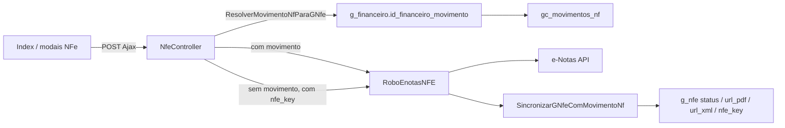

# NFe (área `g`) — arquitetura Ajax + e-Notas

**Data:** 2026-05-20  
**Controller:** `Areas/g/Controllers/NfeController.cs`  
**Robô:** `Robos/ENotas/RoboEnotasNFE.cs`  
**Portal Vendedor:** módulo **removido** (2026-05-19); este documento **não** cobre `PortalVendedorController`.

---

## Fluxo de resolução `g_nfe` ↔ `gc_movimentos_nf`

1. **`g_nfe.id_financeiro`** → **`g_financeiro`** → **`id_financeiro_movimento`** → último **`gc_movimentos_nf`** do movimento.
2. Com **`gc_movimentos_nf`**: gerar/atualizar/cancelar via métodos `*byMovimentoNFId` e sincronizar campos em **`g_nfe`**.
3. Sem movimento, mas com **`g_nfe.nfe_key`**: atualizar/cancelar direto na API (`AtualizarStatusG_nfePorId`, `CancelarG_nfePorId`).

---

## Contratos

| Camada | Padrão |
|--------|--------|
| DataTables (`GetDados`, `GetDadosNfeLogs`) | `errorMessage`, `severity`, `stackTrace`, `yesFilterOnOff`, `aaData`; `JsonDataTableException` no `catch` |
| Ajax modais / Index | `{ success: bool, msg: string, idProcessamento?: string }` |
| Cliente Ajax | `GdiAjaxNotifyInconsistencias(result.msg)` se `success != true`; `LibMessage*` / `LibMessageProcessando` |

---

## Mapa actions Ajax ↔ robô

| Action | Robô / lógica | Notas |
|--------|----------------|-------|
| `AjaxClonarNfe` | Clone EF `g_nfe` (sem API) | JSON body `record_g_nfe.id_nfe` |
| `AjaxCancelarNfe` / `AjaxEnviarCancelamentoNfe` | `CancelarNFPbyMovimentoNFId` ou `CancelarG_nfePorId` | Motivo obrigatório |
| `AjaxNfeEnviarPorEmailUnitario` | Validação e-mail + log `g_nfe_envio_email_log` + CSV `g_processamento` tipo **45** | Não chama API e-Notas |
| `ajaxExportarDadosNfePDF` | CSV período + `g_processamento` tipo **49** | URLs PDF/XML no export |
| `ajaxGerarNfe` | `GerarNFServicoByMovimentoNFId` | Exige `gc_movimentos_nf` |
| `AjaxAtualizarStatusNfe` | `AtualizarStatusNFPbyMovimentoNFId` ou `AtualizarStatusG_nfePorId` | |
| `AjaxSincronizarLotesNfe` | Lote até **200** NFes com `nfe_key` | |
| `ajaxImportarNfeLote` | Upload + relatório texto; **sem** parser XML | Integração futura |

Autorização: classe `[CustomAuthorize(..., g_Nfe_*, g_Nfe_Default)]` cobre todas as actions.

---

## Smoke manual (2.2.4)

Executar em ambiente com gateway e-Notas configurado (`g_nfe_gateway`, `g_nfe_config`):

| # | Caso | Critério OK |
|---|------|-------------|
| 1 | **Index** — listar / filtro avançado | DataTables carrega; `xhr.dt` sem erro |
| 2 | **Export PDF** — modal período | `success: true`; processamento tipo 49; CSV com URLs |
| 3 | **Logs** — `CreateEdit` aba Logs | `GetDadosNfeLogs`; notify JSON em erro |
| 4 | **Clonar** — 1 registro | Novo `id_nfe`; mensagem sucesso |
| 5 | **Gerar NF** — 1 registro com movimento NF | Robô retorna sucesso ou mensagem clara de falta de vínculo |
| 6 | **Atualizar status** — nota com `nfe_key` | Status/PDF/XML atualizados em `g_nfe` |
| 7 | **Cancelar** — motivo preenchido | Modal; sucesso ou mensagem e-Notas |
| 8 | **E-mail unitário** — NFe autorizada com PDF | Processamento tipo 45 ou impedimento documentado |
| 9 | **Sincronizar lote** | Resumo OK/falhas no diálogo |
| 10 | **Download PDF/XML** — colunas da grade | `window.open(url)` quando URL preenchida |

---

## Portal Vendedor (2.2.2 — N/A)

- **Removido:** `PortalVendedorController`, view `PortalFinanceiro`.
- **Mantido (não é o módulo):** roles `g_PortalVendedor_*` em `UsuariosController.ModalUsuarioTrocarSenha` / `AjaxUsuarioTrocarSenha` para logons com `TokenAcesso` iniciando em **`V`** (troca de senha vendedor).
- **Produção:** desativar item de menu `/g/PortalVendedor/PortalFinanceiro` se ainda existir em `g_menu` / navbar.
