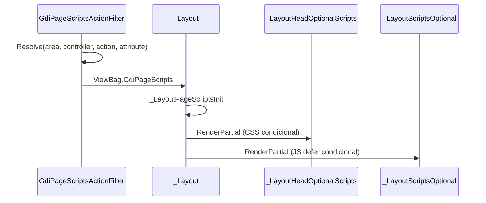

# G-PERF-20 — Fase 3: Infraestrutura de carregamento condicional

**Data:** 2026-05-20  
**IDs:** G-PERF-20d (implementação inicial), consolidação Fase 3 `2026.51.09`  
**VersionERP:** 2026.51.09

---

## Objetivo

Um único ponto no `_Layout` delega CSS/JS opcionais a partials que leem `ViewBag.GdiPageScripts`, resolvido pelo filter global ou fallback por rota.

---

## Componentes

| Peça | Ficheiro | Função |
|------|----------|--------|
| Flags + Resolve | `Lib/GdiPageScripts.cs` | Enum, `[GdiPageScripts]`, `GdiPageScriptsDefaults`, filter |
| View helper | `Lib/GdiPageScriptsView.cs` | `GetFlags` / `EnsureViewBag` sem cast inválido |
| Filter | `App_Start/FilterConfig.cs` | `GdiPageScriptsActionFilter` (global) |
| Init | `Views/Shared/_LayoutPageScriptsInit.cshtml` | Preenche ViewBag antes do HTML |
| Head opcional | `Views/Shared/_LayoutHeadOptionalScripts.cshtml` | Toggle → DT → S2 → jstree |
| Scripts opcional | `Views/Shared/_LayoutScriptsOptional.cshtml` | DT → S2 → jstree → jsFileInput → Toggle |
| Shell | `Views/Shared/_Layout.cshtml` | Init + 2 partials; `data-gdi-page-scripts` no `<body>` |
| Tempus | `_LayoutHead/ScriptsTempus` | **Só** nas 22 views host (Fase 2 / 20c-bis) |

---

## Fluxo



---

## Default por área (`Resolve` sem atributo)

| Área | Flags típicas |
|------|----------------|
| `g`, `gc`, `qa` | `DefaultGcGArea` (Core + DT + S2 + Toggle), exceto controllers em `NoDataTablesControllers` |
| `crm` | Core + Toggle |
| (root) | Core + Toggle |

Overrides **20e:** `[GdiPageScripts(LayoutHub*)]` na action `Index` dos hubs.

---

## Verificação

```bash
python Scripts/2026_05_22_gdi_verify_page_scripts_resolve.py
python Scripts/2026_05_22_gdi_page_scripts_smoke_manifest.py --markdown
```

DevTools: atributo `data-gdi-page-scripts` no `<body>` (valor inteiro das flags) — ex. hub relatório `33` = Core(1)+Toggle(32).

---

## Critérios de aceite (Fase 3)

- [x] Partials head/scripts agregados (`_LayoutHeadOptionalScripts`, `_LayoutScriptsOptional`)
- [x] Filter registado; ViewBag preenchido em toda action MVC
- [x] `_Layout` sem libs opcionais inline duplicadas
- [x] Helper `GdiPageScriptsView` (sem exceção de cast)
- [x] Script verificação `2026_05_22_gdi_verify_page_scripts_resolve.py`
- [ ] Smoke browser homologação (G-SMK / G-PERF-M02)

---

## Referências

- Contrato: `2026_05_22_layout-scripts-contrato-flags.md`
- Fase 4 hubs: `2026_05_22_layout-scripts-20e-validacao.md`
- Tempus hosts: `2026_05_22_layout-scripts-tempus-hosts.md`
