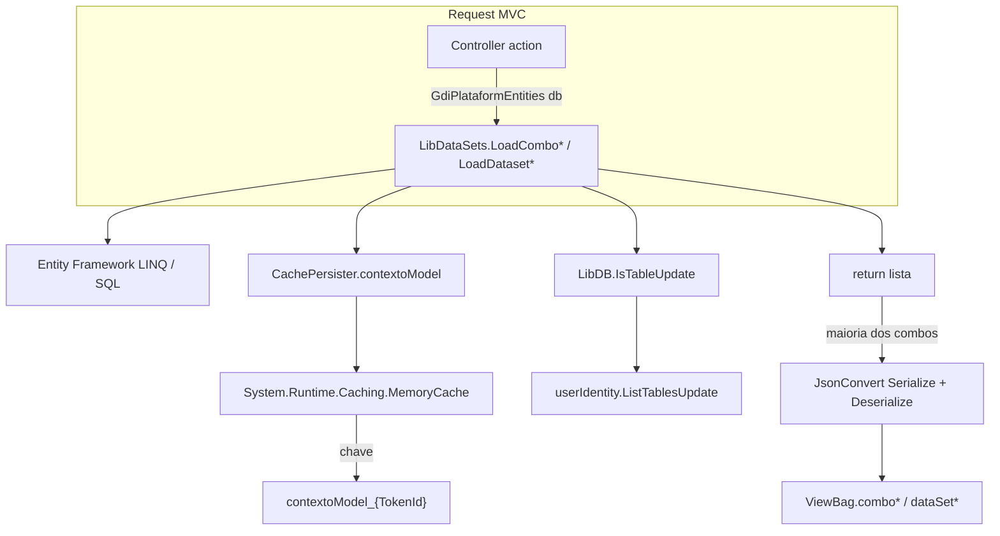

# LibDataSets — Diagnóstico completo e plano de modernização

**Projeto:** GDI-ERP-Plataform  
**Stack:** ASP.NET MVC 5, .NET Framework 4.7.2, Entity Framework 6, SQL Server  
**Data:** 2026-05-20  
**Ficheiro-fonte:** `Lib/LibDataSets.cs` (~1.806 linhas, 67 métodos públicos `Load*`)

**Documentos relacionados:**

| Documento | Conteúdo |
|-----------|----------|
| Este ficheiro | Diagnóstico, arquitetura, riscos, plano de ação (Fases 0–5) |
| [lookups-libdatasets.md](./lookups-libdatasets.md) | Inventário método a método (Fase 0) + registo Fase 1 |
| `Scripts/gdi_inventory_libdatasets.py` | Regenerar inventário após alterações em `LibDataSets` |

---

## 1. Resumo executivo

`LibDataSets` é uma **classe estática monolítica** que centraliza a carga de **listas para `DropDownList`** (`List<SelectListItem>`) e **datasets auxiliares** (listas de entidades/DTOs para JavaScript ou regras em tela). **Não** é `System.Data.DataSet` ADO.NET — o nome reflete o padrão legado “dados de apoio na sessão”.

| Indicador | Valor |
|-----------|-------|
| Métodos `Load*` | 67 (62 combos + 5 datasets) |
| Chamadas em controllers | ~227 em 19 ficheiros |
| Área **gc** | ~162 chamadas |
| Área **g** | ~45 chamadas |
| Área **qa** | ~4 chamadas |
| Maior consumidor | `MovimentosController` (~79 chamadas) |

**Conclusão:** é o principal mecanismo de lookups compartilhados em telas comerciais/COMEX/estoque; convive com lookups **locais** nos controllers (ex.: `ClientesController.PreencherLookupsClientesIndex`), padrão já adotado nas Index modernizadas.

**Status do plano (2026-05-20):**

| Fase | Estado |
|------|--------|
| **Fase 0** — Inventário | Concluída → [lookups-libdatasets.md](./lookups-libdatasets.md) |
| **Fase 1** — Cache paramétrico + null-safety parcial | Concluída → 9 métodos em `LibDataSets.cs` |
| **Fase 2** — `ILookupQueryService` + fachada `LibDataSets` | Concluída (2026-05-20) — ver `Lib/Lookups/` |
| **Fase 3** — MemoryCache sem duplicar `ContextoModel`; invalidação por tabela | Concluída (2026-05-20) |
| **Fases 4–5** | Planejadas |

---

## 2. Diagnóstico — arquitetura atual

### 2.1 Fluxo de dados



### 2.2 Padrão interno (repetido em ~67 métodos)

1. Recebe `GdiPlataformEntities db` (instância do controller).
2. Verifica cache em `CachePersister.contextoModel` (propriedades em `Models/ContextoModel.cs`, ~50+ listas).
3. Se lista vazia **ou** `LibDB.IsTableUpdate(tabela, nomeProcesso, db)` → consulta EF/SQL, monta `SelectListItem`, grava em `contextoModel`.
4. Retorno:
   - **~63 métodos:** cópia profunda via `JsonConvert.SerializeObject` + `DeserializeObject`;
   - **~5 datasets:** retorno direto da lista em cache (ex.: `LoadDatasetGVendedores`, `LoadDatasetGcProdutosServicos`).

### 2.3 Inicialização e ciclo de vida

| Momento | Comportamento |
|---------|----------------|
| **Login** | `UserIdentityController` cria `new ContextoModel { allNavbarItemMenu = ... }` e atribui `CachePersister.contextoModel`. |
| **MemoryCache** | Chave `contextoModel_{TokenId}`, sliding expiration **15 minutos** (`CachePersister.cs`). |
| **Construtor `ContextoModel`** | Inicializa dezenas de `List<SelectListItem>` e datasets vazios. |
| **Primeiro `Load*`** | Preenche a propriedade correspondente sob demanda (lazy por combo). |
| **Invalidação** | `LibDB.IsTableUpdate` compara `MAX(datahora_cadastro/alteracao)` da tabela com timestamp em `userIdentity.ListTablesUpdate` (par tabela + nome do processo). Em exceção, força refresh (`TableUpdate = true`). |

**Não há:** injeção de dependência, factory nem registro central de lookups — apenas chamadas estáticas nos controllers.

### 2.4 Propósito atual

| Função | Descrição |
|--------|-----------|
| **Combos reutilizáveis** | Evitar repetir LINQ em dezenas de actions (“lista de clientes”, “CFOP”, “locais de estoque”, etc.). |
| **Cache de sessão** | Reduzir round-trips SQL na navegação entre telas do mesmo usuário. |
| **Datasets para JS** | Ex.: `LoadDatasetGcProdutosServicos`, `LoadDatasetGcClientesContatos` → `ViewBag.dataSet*` para autocomplete/validação no cliente. |
| **Regras embutidas** | Filtros por role (`gc_Movimentos_*`), vendedor, flags (`param_gc_transportadora`), opções fixas hardcoded (ex. tipos de movimento compras). |

### 2.5 Onde é utilizada

**Controllers consumidores (19 ficheiros):**

- `Areas/gc/Controllers/MovimentosController.cs` (~79)
- `Areas/gc/Controllers/MovimentosComprasController.cs` (~28)
- `Areas/gc/Controllers/FinanceiroLancamentosController.cs` (~16)
- `Areas/g/Controllers/AtendimentosController.cs` (~16)
- `Areas/gc/Controllers/EstoqueInventarioController.cs` (~13)
- `Areas/gc/Controllers/EstoqueControleController.cs` (~12)
- `Areas/g/Controllers/ContratosAviacaoController.cs`, `RelatoriosFinanceirosController.cs`, `EstoqueController.cs`, `GedController.cs`, `ClientesController.cs`, `CfopOperacoesController.cs`, `ComexProdutosController.cs`, `EstoqueLotesController.cs`, `MovimentosEntradasController.cs`, `FretesController.cs`, `CfopParametrosController.cs`, `Areas/qa/Controllers/GedSGQController.cs`

**Métodos mais chamados:** `LoadComboGcProdutosServicosTodos`, `LoadComboGClientesFornecedores`, `LoadComboGcTransportadora`, `LoadComboGcLocaisEstoqueOrders`, `LoadDatasetGcProdutosServicos`, `LoadComboGcClientesContatos`, `LoadComboGVendedores`.

**Telas que já evitam `LibDataSets` para filtros Index (tendência moderna):** Clientes, Perfis, Cidades, Usuarios, Produtos — combos locais / `PreencherLookups*`.

---

## 3. Problemas e riscos identificados

### 3.1 Estruturais

| # | Problema | Impacto |
|---|----------|---------|
| 1 | **Classe “god object”** (~1.806 linhas) | Difícil testar, revisar PRs, evoluir sem regressão |
| 2 | **Cópia JSON em massa** (~63 retornos) | CPU/GC desnecessários; provável tentativa de “desacoplar” mutações |
| 3 | **Cache com chave única por tipo de combo** | Combos **parametrizados** gravam na mesma propriedade global (ver §3.2) |
| 4 | **`contextoModel` pode ser null** | Risco de `NullReferenceException` fora do fluxo de login (mitigado parcialmente na Fase 1 nos métodos corrigidos) |
| 5 | **Invalidação frágil** | `IsTableUpdate` depende de `datahora_cadastro/alteracao`; granularidade por **processo**, não por parâmetro |
| 6 | **Duplicação de estratégias** | `LibDataSets` vs `PreencherLookups*` inline → inconsistência |
| 7 | **Acoplamento a `SelectListItem`** | Dificulta API JSON sem camada de mapeamento |

### 3.2 Bugs de cache paramétrico (Fase 1 — corrigidos em 2026-05-20)

| Método | Sintoma | Causa |
|--------|---------|-------|
| `LoadComboGcClientesDestinatarios` | Combo de destinatário do cliente A após abrir cliente B | Slot global `gc_comboGcClientesDestinatarios` |
| `LoadDatasetGcClientesDestinatarios` | Dataset JS com destinatários misturados | Lista global `gc_dataSetClientesDestinatarios` |
| `LoadComboGcCfopOperacoesFaturamentoPedido` | Operações CFOP erradas no faturamento | Gravava em `gc_comboGcCfopOperacoes` (compartilhado) |
| `LoadComboGcClientesContatos` | Contatos do cliente errado | `gc_comboClientesContatos` ignorava `IdCliente` |
| `LoadComboGcEstoqueEndereco*` (4 métodos) | Endereço de outro local de estoque | Só recarregava se `Count == 0`, ignorava `IdLocalEstoque` |
| `LoadComboGedArquivosTipos` | Árvore de tipos GED errada entre módulos SGQ | Cache global ignorava `IdTipo` / `IdTipoPai` |

**Nota:** `LoadComboGcClientesContatosPedido` já não usava cache global (sem alteração).

### 3.3 Riscos ainda abertos (pós-Fase 1)

- Combos **globais** grandes (todos os clientes/produtos ativos) continuam em memória de sessão — pressão de RAM e dados desatualizados até `IsTableUpdate` disparar.
- Métodos não paramétricos ainda acessam `CachePersister.contextoModel` sem `EnsureContextoModel()` uniforme.
- `LoadComboGcIcmsUfIsento` e similares: ramo `if (Count == 0)` preenche lista mas **não atribui** ao cache na primeira execução (bug legado separado, fora da Fase 1).

---

## 4. Referência — boas práticas Microsoft (stack atual)

Sem migrar para ASP.NET Core, práticas aplicáveis:

| Tema | Recomendação | Adequação ao GDI |
|------|--------------|----------------|
| **Camadas** | Serviços de aplicação para leitura; não static helpers globais | `ILookupQueryService` por domínio |
| **Cache** | `MemoryCache` com **chaves explícitas** (sessão + entidade + parâmetros + versão) | Evoluir além das 50+ propriedades fixas em `ContextoModel` |
| **EF6 leitura** | `AsNoTracking()`, projeção (`Select`), evitar entidades completas para combo | Padronizar em novos serviços |
| **MVC 5** | `ViewBag` na borda; listas montadas no controller via serviço | Manter contrato atual das views |
| **DI (opcional 4.7.2)** | `IDependencyResolver` para `ILookupService` | Fase 2: `LibDataSets` como fachada obsoleta que delega |
| **Testes** | Serviços instanciáveis | Classe estática atual é pouco testável |

**Fora de escopo no plano mínimo:** ASP.NET Core, Redis, MediatR, cache distribuído.

---

## 5. Plano de modernização

### Princípios

- **Estrangulamento gradual** — código novo não chama `LibDataSets` diretamente quando possível.
- **Compatibilidade** — fases iniciais mantêm assinaturas `LibDataSets.Load*` delegando ao serviço novo.
- **Alteração mínima** — priorizar correções de bug e extração de serviço antes de refatorar 67 métodos de uma vez.

---

### Fase 0 — Inventário e métricas ✅ Concluída

**Objetivo:** mapa completo método × controller × cache × risco.

**Entregáveis:**

- [lookups-libdatasets.md](./lookups-libdatasets.md) (tabela dos 67 métodos, chamadas, risco Fase 1)
- `Scripts/gdi_inventory_libdatasets.py` (regeneração)

**Critério de aceite:** qualquer método `Load*` documentado com parâmetros, propriedade `contextoModel`, uso de `IsTableUpdate` e contagem de chamadas.

---

### Fase 1 — Correções de baixo risco ✅ Concluída (2026-05-20)

| Item | Ação | Estado |
|------|------|--------|
| Null-safety | `EnsureContextoModel()` nos métodos paramétricos corrigidos | ✅ |
| Cache paramétrico | Sem gravar em slot global; consulta sempre pelo parâmetro | ✅ 9 métodos |
| Clone defensivo | `CloneSelectList()` em vez de JSON nos métodos corrigidos | ✅ |
| Convenção | Documentar: Index/filtro = query local; combo compartilhado pedido = serviço (CLAUDE / CHANGELOG) | Parcial |

**Ficheiros alterados:** `Lib/LibDataSets.cs` apenas (controllers/views inalterados).

**Validação manual recomendada:**

1. Pedido (`Movimentos`): trocar cliente → contatos e destinatários atualizam.
2. Inventário estoque: trocar local → área/seção/corredor/prateleira atualizam.
3. GED SGQ: cada índice (Qualidade, POPs, Comunicados, Atas) com filtro de tipo correto.

---

### Fase 2 — Extrair serviço de lookups (planejada, 1–2 semanas)

**Objetivo:** desacoplar lógica testável sem quebrar consumidores.

**Estrutura proposta:**

```
Lib/Lookups/
  ILookupQueryService.cs       // contratos read-only
  LookupCacheKeys.cs           // constantes de chave MemoryCache
  LookupQueryService.cs        // EF6 + MemoryCache
  Lookups/Comercial/           // opcional: partials por domínio
```

**Passos:**

1. Definir `ILookupQueryService` com os **15–20** métodos de maior uso (ver inventário).
2. Implementar com cache por chave: `lookup:{nome}:{parametros}:{versaoTabela}`.
3. Registrar em `DependencyResolver` (MVC 5) ou factory estática temporária.
4. `LibDataSets`: cada método vira delegação one-liner para o serviço (fachada de compatibilidade).

**Alteração nos controllers:** opcional nesta fase; manter `LibDataSets.*` nas views.

**Critério de aceite:** build OK; testes manuais nos fluxos P1; pelo menos um teste de integração para combo paramétrico.

---

### Fase 3 — Reduzir superfície de `ContextoModel` (planejada, 2–3 semanas)

**Objetivo:** `ContextoModel` só para contexto de UI (menu, filial), não catálogo de 50 combos.

**Passos:**

1. Migrar listas de combo do `ContextoModel` para entradas em `MemoryCache` com chaves compostas.
2. Manter propriedades legadas como proxies ou deprecar gradualmente.
3. Alinhar `IsTableUpdate` à invalidação por prefixo de chave (ex. `lookup:g_clientes:*`).

**Risco:** regressão em telas que leem `CachePersister.contextoModel.gc_combo*` diretamente (grep antes de remover propriedades).

---

### Fase 4 — Estrangulamento por módulo (planejada, contínua)

| Prioridade | Módulo | Motivo |
|------------|--------|--------|
| P1 | `MovimentosController`, `MovimentosComprasController` | ~107 chamadas combinadas |
| P2 | `FinanceiroLancamentosController`, `EstoqueInventarioController` | Combos + datasets JS |
| P3 | `AtendimentosController`, `ContratosAviacaoController`, demais gc/g | Volume médio |
| P4 | Limpeza final | Métodos órfãos |

**Por tela migrada:**

- Substituir N× `LibDataSets` por 1× `PreencherLookupsPedido()` no controller **ou** 2–3 chamadas ao `ILookupQueryService`.
- Combos enormes (clientes/produtos): avaliar endpoint Ajax typeahead (`GetClientesLookup?q=`) alinhado a `GdiAjax*` / DataTables.

---

### Fase 5 — Deprecação de `LibDataSets` (planejada, após ~80% migração)

1. `[Obsolete]` por método em `LibDataSets`.
2. Script `Scripts/gdi_inventory_libdatasets_usage.py` (falha se houver referências não migradas).
3. Remover métodos sem referências; limpar propriedades órfãs em `ContextoModel`.
4. Atualizar [lookups-libdatasets.md](./lookups-libdatasets.md) e este documento.

---

## 6. O que NÃO fazer no plano mínimo

- Reescrever os 67 métodos num único PR.
- Migrar para ASP.NET Core / minimal APIs.
- Introduzir Redis ou segundo repositório de cache distribuído.
- Alterar views Razor em massa sem necessidade de contrato.
- Remover `JsonConvert` clone globalmente antes de medir impacto em mutações de listas.

---

## 7. Impacto em publish e operação

| Tema | Nota |
|------|------|
| **SQL Server** | Sem alteração de schema nas fases 0–1 |
| **IIS / sessão** | Cache continua por usuário (TokenId); monitorar memória em usuários com muitas telas abertas |
| **Publish** | Recompilar após Fase 1+; validar Movimentos, Inventário, GED |
| **Rollback** | Fase 1 é reversível em `LibDataSets.cs` sem mudança de contrato público |

---

## 8. Histórico de decisões

| Data | Decisão |
|------|---------|
| 2026-05-20 | Fase 0: inventário automatizado em `lookups-libdatasets.md` |
| 2026-05-20 | Fase 1: combos paramétricos sem cache global; helpers `EnsureContextoModel` / `CloneSelectList` |
| 2026-05-20 | Fases 2–5 adiadas; manter `LibDataSets` como fachada até strangler por módulo |
| 2026-05-20 | Novas Index com filtro inline: preferir query local (padrão Clientes/Perfis), não expandir cache global em `ContextoModel` |

---

## 9. Referências no repositório

| Artefato | Caminho |
|----------|---------|
| Classe principal | `Lib/LibDataSets.cs` |
| Modelo de cache UI | `Models/ContextoModel.cs` |
| Persistência cache | `Security/CachePersister.cs` |
| Invalidação tabelas | `Lib/LibDB.cs` → `IsTableUpdate` |
| Login / init contexto | `Controllers/UserIdentityController.cs` |
| Regras agente / padrões | `.cursor/rules/gdi-erp-plataform.mdc`, `CLAUDE.md` |
| Changelog | `.cursor/CHANGELOG-DEV.md` (entrada LibDataSets Fase 0/1) |

---

*Documento de referência para arquitetura e roadmap. Para tabela linha a linha de cada `Load*`, usar [lookups-libdatasets.md](./lookups-libdatasets.md).*
